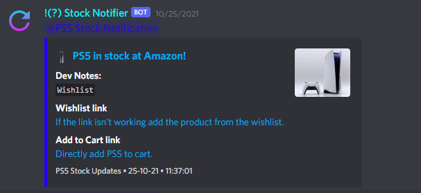
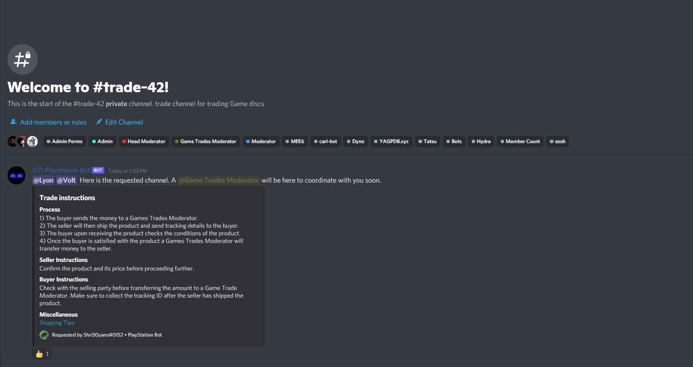

## ***PlayStation Discord Bot***
### Functions:

* Stock notifications for PS5 (India Only) (Amazon, Flipkart, ShopAtSC, Prepaid Gamer Card, Games the Shop)
* Stock notifications for Xbox Series X and Series S (India Only) (Amazon, Flipkart)
* Create Trade Channels

[Join the Console Stock Notification India Server.](https://discord.gg/NXUuNuusJM)

### Pictures:
   
*PS5 Stock Alert* 

   
*Xbox Series S Stock Alert*   
 
   
*Creating a Trade Channel*
     
   
*Auto-message in Trade Channel*  


### Basic Setup:
1. Install all the required modules with: (Ubuntu)
```
sudo pip3 install -r requirements.txt
```
2. Install playwright with: (Optional, only for Playwright mode/ Headless Browser mode)
```
playwright install
```

## Discord Setup
1. Obtain a Discord bot token from the [Discord developer portal](https://ptb.discord.com/developers/applications/)
2. Add the bot to a server and fill in the channel ids in config.py
3. Fill in the bot credentials in the .env file.

## Twitter Setup
1. Apply for a Twiiter Developer account from the [Twitter developer site](https://developer.twitter.com/)
2. Create a new app and register it from the [Twitter apps page](https://developer.twitter.com/en/portal/projects-and-apps)
3. Once a new app is created the Consumer key and Consumer Secret is opened up. Add these to the .env file.
4. Go back to the apps page and click on the "Keys and tokens" menu. Here the access token and access token secret can be seen. Add this to the .env file as well.

## Telegram Setup
1. On Telegram, search @BotFather, send him a `/start` message
2. Send another `/newbot` message, then follow the instructions to setup a name and a username.
3. A API Token/ Bot Token is shown. Add this token to the .env file.
4. 


### Run script:

    python bot.py


