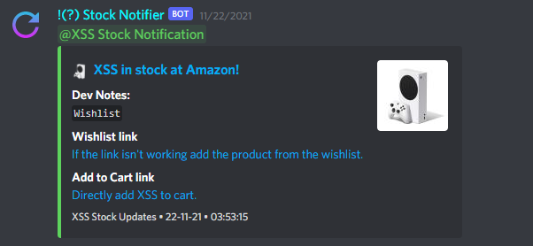
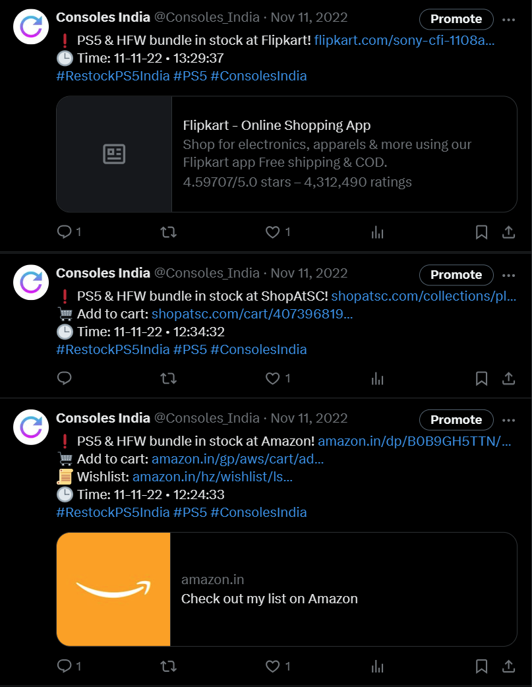
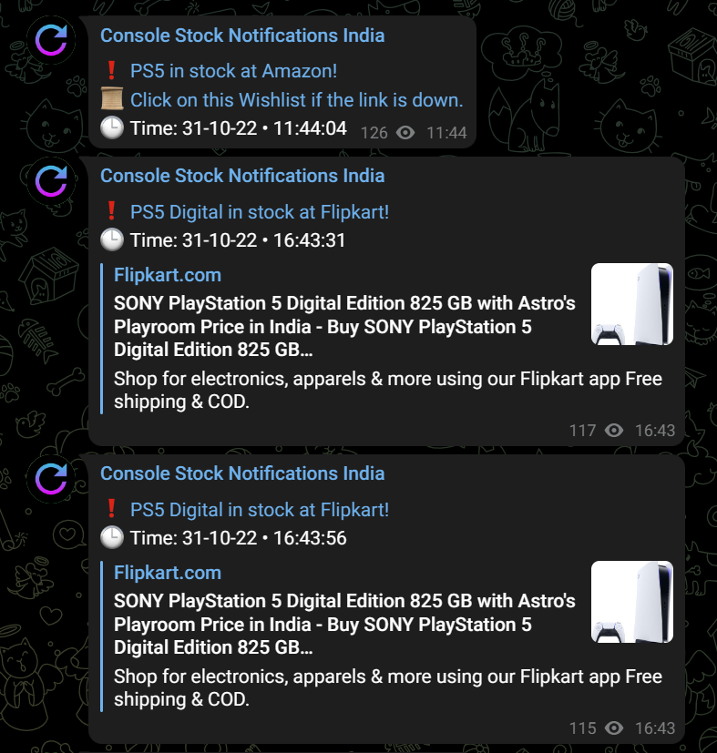

<div align="center" style="padding: 10px;">
    
    <h1>Consoles India Discord Bot</h1>
    <a href="https://twitter.com/Consoles_India"></a>
    <a href="https://t.me/Consoles_India"></a>
    <a href="https://discord.gg/4WqnrD3sRx"></a>
</div> <br>


Check out the [Discord Bot](https://github.com/shri30yans/Consoles_India_DiscordBot) version for Discord Features.

### Features
- Multiplatform Asynchronous scrapping.
- Notifications on Discord, Twitter and Telegram.
- Supports both Requests library and Playwright for Headless Browser mode scrapping.
- Logging

### Platforms currently supported
- Amazon
- Flipkart
- ShopAtSC
- Prepaid Gamer Card
- Games the Shop


### Working:
   
*PS5 Stock Alert* 

   
*Xbox Series S Stock Alert*   

   
*PS5 Twitter Stock Alert* 

   
*PS5 Telegram Stock Alert* 

   
*Creating a Trade Channel*

   
*Auto-message in created Trade Channel* 

### Basic Setup:
1. Install all the required modules with: (Ubuntu)
```
sudo pip3 install -r requirements.txt
```
2. Set up the .env file. Check out the example file [.env](/.env example)
3. Install playwright with: (Optional, only for Playwright mode/ Headless Browser mode)
```
playwright install
```

## Discord Setup
1. Obtain a Discord bot token from the [Discord developer portal](https://ptb.discord.com/developers/applications/)
2. Add the bot to a server and fill in the channel ids in config.py
3. Fill in the bot credentials in the .env file.

## Twitter Setup
1. Apply for a Twitter Developer account from the [Twitter developer site](https://developer.twitter.com/)
2. Create a new app and register it from the [Twitter apps page](https://developer.twitter.com/en/portal/projects-and-apps)
3. Once a new app is created the Consumer key and Consumer Secret is opened up. Add these to the .env file.
4. Go back to the apps page and click on the "Keys and tokens" menu. Here the access token and access token secret can be seen. Add this to the .env file as well.

## Telegram Setup
1. On Telegram, search @BotFather, send him a `/start` message
2. Send another `/newbot` message, then follow the instructions to setup a name and a username.
3. A API Token/ Bot Token is shown. Add this token to the .env file.
   
### Run script:
```
python bot.py
```