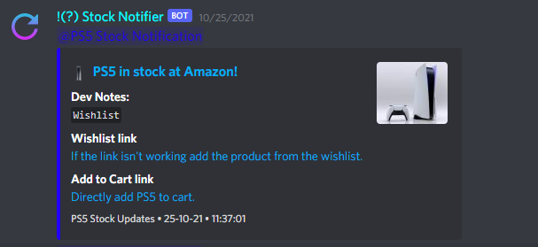
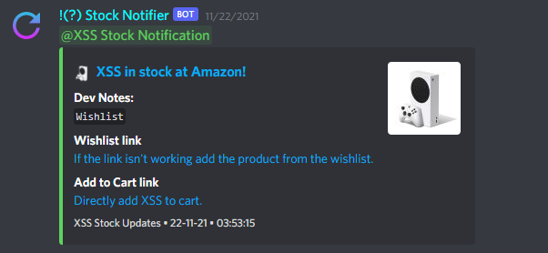
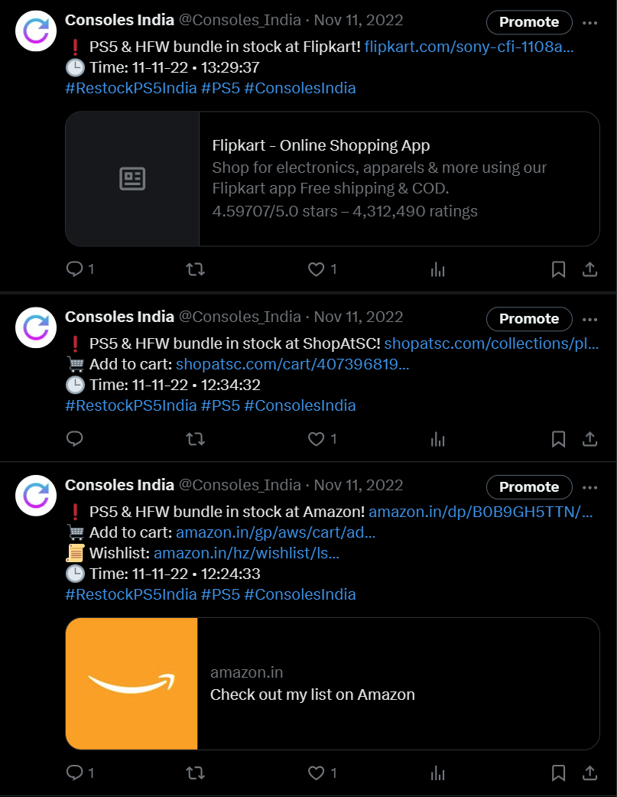
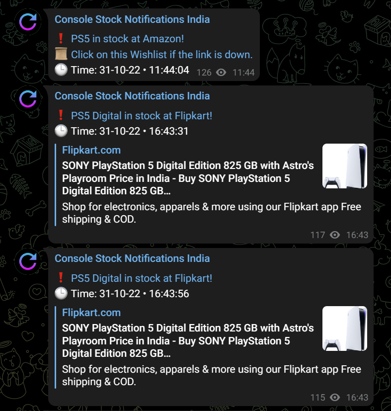
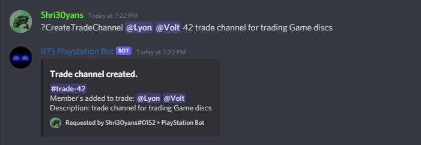
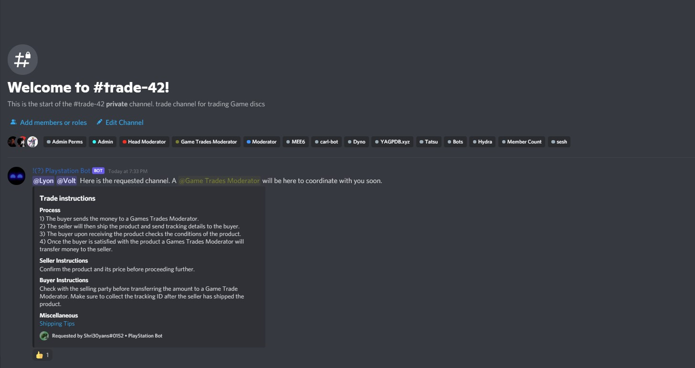

<div align="center" style="padding: 10px;">
    
    <h1>Consoles India Stock Notifier</h1>
    <a href="https://twitter.com/Consoles_India"></a>
    <a href="https://t.me/Consoles_India"></a>
    <a href="https://discord.gg/4WqnrD3sRx"></a>
</div> <br>
A versatile stock-checking project that helps you secure in-demand products. It leverages asynchronous multi-site scraping to provide real-time availability updates, ensuring that you never miss any drops. Originally created for PS5 and XSX stock notifications in India. 

### Discord Integration
Check out the [Discord Bot](https://github.com/shri30yans/Consoles_India_DiscordBot) version for Discord Features.

### Features
- Multiplatform Asynchronous scrapping.
- Notifications on Discord, Twitter and Telegram.
- Flexible Customization to track any product across chosen sites
- Supports both Requests library for traditional scrapping and Playwright for Browser based scrapping.
- Comprehensive Logging

### Platforms currently supported (parsers)

- Amazon (wishlist pages and standard product pages)
- Flipkart

Other retailer links may still appear in `config/products.yaml` for reference, but monitoring jobs must only use **amazon** or **flipkart** (`website_key` in `config/jobs.yaml`).


### Working:
   
*PS5 Stock Alert* 

   
*Xbox Series S Stock Alert*   

   
*PS5 Twitter Stock Alert* 

   
*PS5 Telegram Stock Alert* 

   
*Creating a Trade Channel*

   
*Auto-message in created Trade Channel* 

### Basic Setup:
1. Install all the required modules with: (Ubuntu)
```
sudo pip3 install -r requirements.txt
```
2. Set up the .env file. Check out the example file [.env](/.env example)
3. Install playwright with: (Optional, only for Playwright mode/ Headless Browser mode)
```
playwright install
```

## Discord Setup
1. Obtain a Discord bot token from the [Discord developer portal](https://ptb.discord.com/developers/applications/)
2. Add the bot to a server and fill in the channel ids in your product YAML or integration config as needed.
3. Fill in the bot credentials in the .env file.

## Twitter Setup
1. Apply for a Twitter Developer account from the [Twitter developer site](https://developer.twitter.com/)
2. Create a new app and register it from the [Twitter apps page](https://developer.twitter.com/en/portal/projects-and-apps)
3. Once a new app is created the Consumer key and Consumer Secret is opened up. Add these to the .env file.
4. Go back to the apps page and click on the "Keys and tokens" menu. Here the access token and access token secret can be seen. Add this to the .env file as well.

## Telegram Setup
1. On Telegram, search @BotFather, send him a `/start` message
2. Send another `/newbot` message, then follow the instructions to setup a name and a username.
3. A API Token/ Bot Token is shown. Add this token to the .env file.

## Configuration (YAML)

Full reference: [docs/configuration.md](docs/configuration.md).

- `config/app.yaml` — `notify`, `mode`, affiliate tag, Telegram chat, **logging** (`json_lines`, rotation), **fetch** (jitter, concurrency cap).
- `config/products/<KEY>.yaml` — one file per product; `key` must match the filename stem.
- `config/websites/amazon.yaml` and `config/websites/flipkart.yaml` — display name, optional HTTP headers, Amazon wishlist ASIN map.
- `config/jobs.yaml` — which `(product, website)` pairs to poll, transport, and `delay_seconds`.

Override the config root with `STOCK_NOTIFIER_CONFIG_DIR` if needed.

### Development

```text
pip install -r requirements-dev.txt
ruff check stock_notifier tests && ruff format --check stock_notifier tests
mypy stock_notifier
```

On machines where a globally installed `pytest` plugin breaks startup (rare), run tests with autoload disabled:

```text
set PYTEST_DISABLE_PLUGIN_AUTOLOAD=1
pytest
```

Pre-commit: `pre-commit install` then hooks run `ruff` on commit.

### Run

```
python -m stock_notifier
```

or `python main.py` / `python bot.py` (same entrypoint).


### Contributions
This project welcomes contributions. Feel free to suggest new features, report bugs, or improve the codebase.
